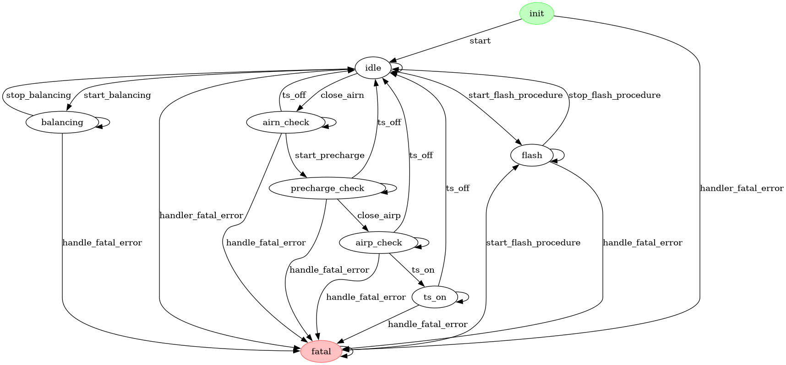

# Balancing procedure

## Idle state
In idle state wait for a `FSM_EVENT_TYPE_BALANCING_START` fired event that comes from from either the steering wheel or the handcart.

### Idle to balancing
Calls `bal_start`, sets the status to active and it enables the task that every 50ms sends the balancing status to the cellboards.

## Balancing state
The only thing that the FSM does in this state is wait for the `FSM_EVENT_TYPE_BALANCING_STOP` event trigger from either handcart, steering wheel or from the watchdog timeout as technically it isn't doing anything.
The mainboard needs a heartbeat from either the steering wheel or the handcart to keep this status. The timeout is 3s long.
Every 200ms the mainboard sends a heartbeat payload to the cellboards that contains the "started" status, a target voltage and a treshold.

### Balancing to Idle
Calls `bal_start`, sets the status to inactive and disables the task that keeps alive the cellboards. The cellboards will then die after their watchdog ends.